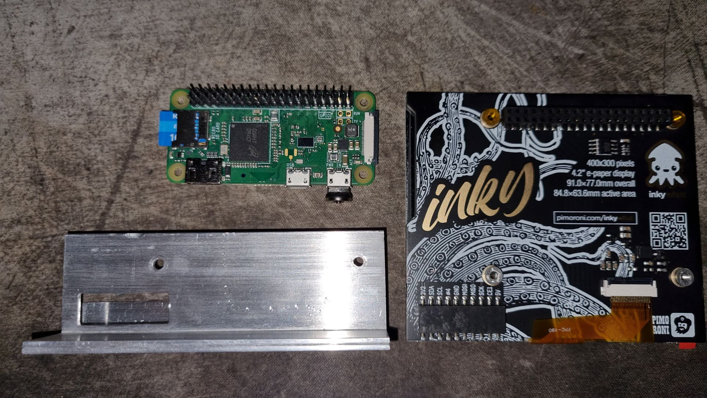
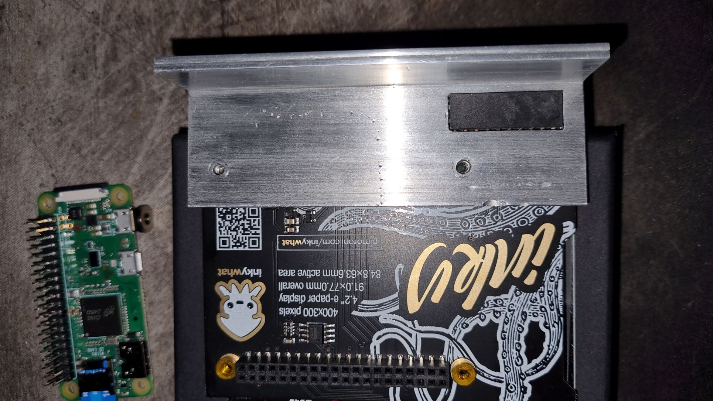
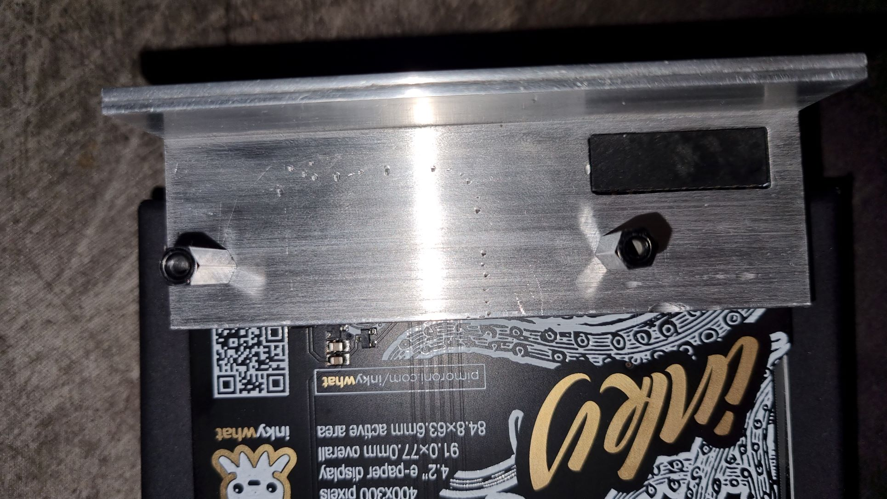
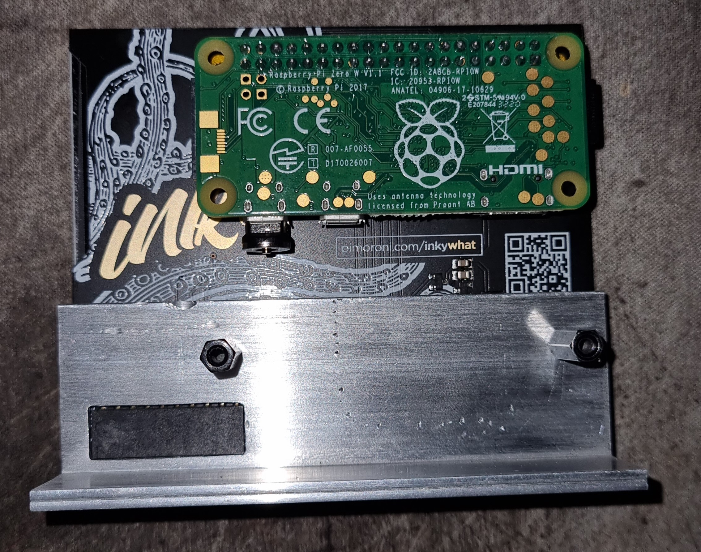

# Assembly Instructions
> The screen is an e-ink glass display and is quite delicate, we recommend holding it by the edges, and avoiding applying  pressure to the glass covered side.  

## Your BitBot consists of 3 parts
 - Screen
 - Raspberry Pi
 - Stand

## Steps
1. Line the screen up with the stand, so that the screw holes are visible, and the bottom corner connector is seated in it's rectangular hole.  

2. Screw the stand to the screen using the supplied standoff screws  

4. Gently push the raspberry pi pins into the connector at the top of the screen, ensuring that it is correctly lined up, and that the incuded Micro-SD card is securely seated in the Raspberry Pi.

5. Attach the USB cable and wait for the screen to refresh, indicating that it needs a wifi connection.