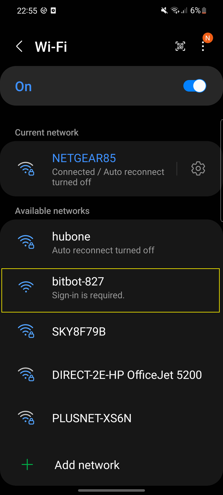
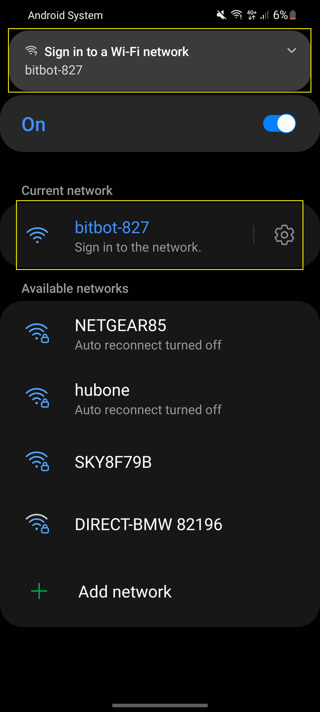
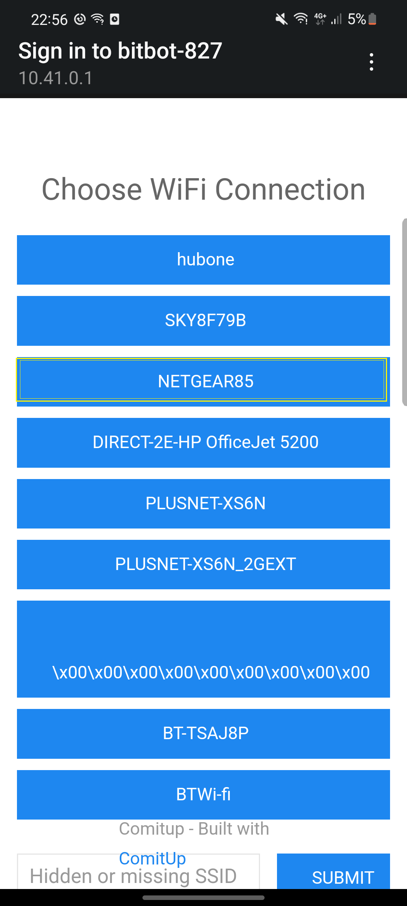
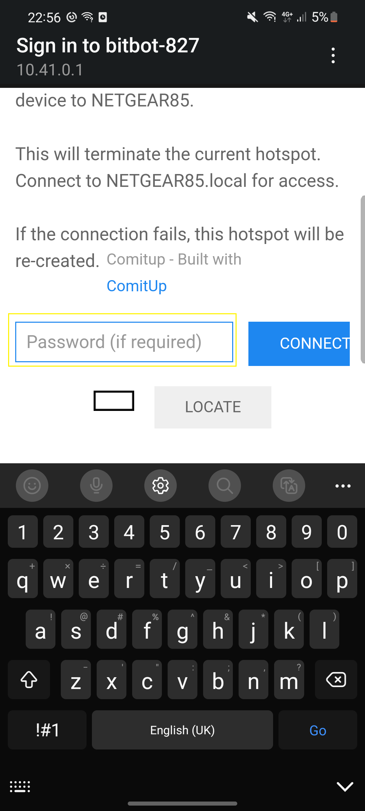

# 🤖 Bitbot WiFi Setup
 * After powering up for the **first time**, your Bitbot will show a message indicating that it has **no wifi connection**.

 * While in this state, Bitbot will ***run it's own wifi access-point*** that you may connect to.

 * ***Use your phone***, or other **wifi device** to connect to this access-point, where you will be **guided** through the process of connecting Bitbot to your **home wifi**.
---
## Detailed guide
 * Here we demonstrate connecting bitbot to my home wifi (NETGEAR85) using an android phone

<table>
    <tr>
        <td>1. </td>
        <td>2. </td>
        <td>3. </td>
        <td>4. </td>
    </tr>
</table>

* **Once completed** your phone will disconnect, Bitbot will then proceed to ***show a chart***  
---
## Troubleshooting
 >  ### I dont see my home wifi in step 3
 - Bitbots raspberry pi has quite a ***small antenna***, and it may be struggling to get a **good signal**. Try moving your Bitbot to a location closer to your home WiFi access-point 
 > ### I dont see the Bitbot WiFi access-point
 - Ensure that your Bitbot is **powered up** and has refreshed its screen to show the ***connection warning message***, there should be a **green light** on the back of the raspberry pi.
 - In case of a software failure, you can ***use a computer*** to [write your wifi details **directly to the SD-Card**](https://www.raspberrypi-spy.co.uk/2017/04/manually-setting-up-pi-wifi-using-wpa_supplicant-conf/).
 > ### My phone/computer does not prompt me to sign-in
 - Your phone may ask you if you **want to stay connected** even though there is ***no internet access***, please stay connected if this happens.
 - Open a browser window and type **bitbot** into the **address bar**, you should now be presented with a list of wifi access points as per **step 3 in the Detailed Guide above**.
