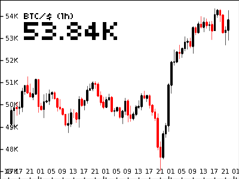

# bit bot
**A Raspberry Pi powered e-ink screen with crypto price chart**




 - hilights the current price
 - shows instrument details (e,g, ```(XBTUSD, hi:200, lo: 2)```)
 - displays some AI text comment/message depending on input data
 - libs are capable of reading and trading on many different crypto-exchanges
 - reddit discussion [here](https://www.reddit.com/r/raspberry_pi/comments/mrne5p/my_eink_cryptowatcher/) 


# app setup
1. Install the inky libs & configure pi for the inky display
    ```sh
    curl https://get.pimoroni.com/inky | bash
    ```

2. Enable SPI and I2C in the pi's boot config and give our user permissions
    ```sh
    sudo apt-get update
    # spi comms have to be enabled
    sudo bash -c 'echo dtparam=spi=on >> /boot/config.txt'
    sudo bash -c 'echo dtparam=i2c_arm=on >> /boot/config.txt'
    # user must be in i2c group
    sudo groupadd i2c 
    # own the /dev/i2c
    sudo chown :i2c /dev/i2c-1
    sudo chmod g+rw /dev/i2c-1
    sudo usermod -aG i2c $USER
    sudo usermod -aG kmem $USER
    ```   

3. Apt get python and all the other packages we need
    ```sh
    # this's from some heavy fuckery on the arm6 chip, probs not needed now
    apt install python-dev
    apt install libffi-dev
    apt-get install build-essential
    apt-get install libjpeg62
    apt-get install libopenjp2-7-devy
    apt-get install libatlas-base-dev
    ```

4. Pip install python packages
    ```sh
    pip3 -install requirements.txt
    ```

5. Configure a bitmex api account (if you want to buy/sell)
    - Currently this is just bitmex, but ccxt supports many more
    - bitmex api key/pass must to be added to the python code in [bitmex_ccxt.py](bitmex_ccxt.py)

6. Set the graph to auto refresh
   ```sh
   crontab -e
   ```
   At the end of the file, add the following commands with your correct file path and save
   ```sh
   @reboot sleep 30 && python3 /'file'/'path'/update_chart.py
   */10 * * * * python3 /'file'/'path'/update_chart.py
   ```
   
7. Run the app
    ```sh
    python3 -m update_chart
    ```

# device setup
 - In order that buyers leave positive reviews and have a frictionless setup experience
 - As a seller of crypto watchers
 - I want the crypto-watcher to expose a wifi AP hotspot for first-time configuration when there is no usable wifi connection


# dumb ideas
 - alert & refresh on spikes
 - maybe an indicator light too
 - noises?
 - display max/min for today
 - buy button
 - timespan slider pot


# todo
 - display a message if the app cannot connect to the internet
 - configuration captive hotspot
 - easily changeable exchange/instrument
 