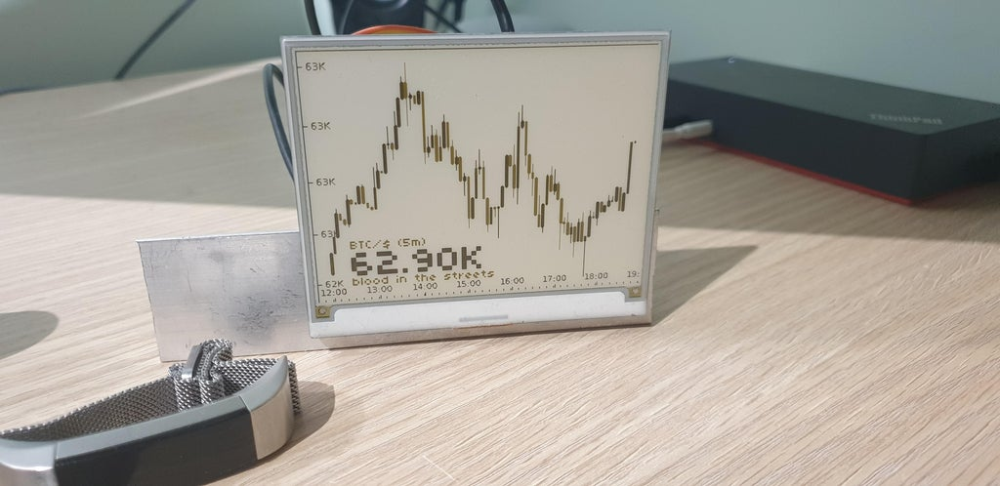

## **BitBot**, *A Raspberry Pi powered e-ink screen with crypto price chart*  
<div>
    
    
    
</div>

# Basic features
 - shows the current price
 - shows instrument details (e,g, ```(XBTUSD, +12%)```)
 - displays some AI text comment/message depending on input data
 - libs are capable of reading and trading on many different crypto-exchanges
 - reddit discussion [here](https://www.reddit.com/r/raspberry_pi/comments/mrne5p/my_eink_cryptowatcher/) 


# Device setup
 > wifi connection script provided by https://github.com/jasbur/RaspiWiFi
```sh
git clone https://github.com/jasbur/RaspiWiFi
cd RaspiWiFi
sudo python3 initial_setup.py
```

>Install the inky libs & configure pi for the inky display
```sh
curl https://get.pimoroni.com/inky | bash
```

>Apt get python and all the other packages we need
```sh
sudo apt-get install -y python-dev libffi-dev build-essential libjpeg62 libopenjp2-7-dev libatlas-base-dev python3-pip
```

>Pip install python packages
```sh
pip3 -install requirements.txt
```

>Set the graph to auto refresh
```sh
crontab -e
```
At the end of the file, add the following commands with your correct file path and save
```sh
@reboot sleep 30 && python3 /'file'/'path'/update_chart.py
*/10 * * * * python3 /'file'/'path'/update_chart.py
```
   
>Run the app
```sh
python3 -m update_chart
```

# Features

>**As** Marketing  
**In order that** customers give bitbot **glowing reviews** about the easy setup process  
>**I want** new users to have a simple means to **connect bitbot to their wifi**  
**So that** they can **easily link** the device to their network  

 - *Scenario:* `No wifi is available, so bitbot creates it's own hostspot for configuration.`
 - *Scenario:* `A user connects to the configuration hotspot, and sets bitbot to connect to an existing wifi access point.`

>**As** Marketing  
**In order that** bitbot appeals to as **many people as possible**  
**I want** the **displayed instrument** to be configurable  
**So that** users can follow their **preferred cryptocurrency**

 - *Scenario:* `Bitbot defaults to showing bitmex BTC/USD ticker.`
 - *Scenario:* `Bitbot is configured to show an ETH/USD chart.`

>**As** Marketing  
**In order that** bitbot looks **aesthetically pleasing ** 
**I want** the price display to **avoid overlapping** the chart  
**So that** users can **clearly see** both chart and current price

 - *Scenario:* `Current price is displayed in a large font, and avoids covering the chart.`
 - *Scenario:* `Current price has a white background when it has to cover some of the chart.`

>**As** Support  
**In order** to **minimise support work** generated by networking problems  
**I want** users to see a **connection error screen** when bitbot has no internet connection  
**So that** that they know when their device is disconnected and **cannot update the chart**  

 - *Scenario:* `Wifi is connected, but bitbot cannot connect to google, so an error is shown.`
 - *Scenario:* `Wifi is not connected, so an error is shown.`
 - *Scenario:* `Wifi is connected, and bitbot can ping google, so loads the chart.`

>**As** Marketing   
**In order that** we can promote the device as a trading bot  
**I want** bit bot to be configurable to make orders at regular intervals  
**So that** users can use DCA trading strategies  
 - *Scenario:* `bit bot is configured with trading account details, buy frequencey and amount.`
 - *Scenario:* `bit bot used configured trading info to automatically place orders for the customer.`