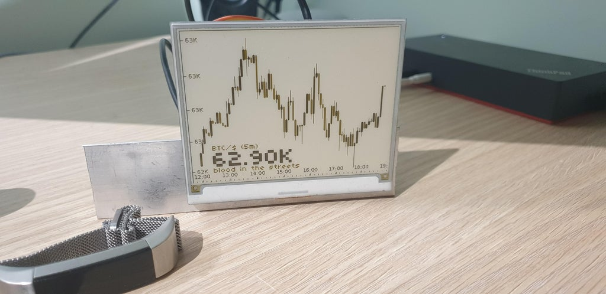
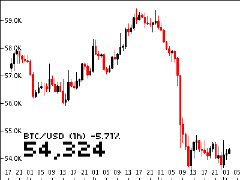

## **BitBot**, *A Raspberry Pi powered e-ink screen with crypto price chart*  
<div>
    
    
    
</div>

# Basic features
 - shows the current price
 - shows instrument details (e,g, ```(XBTUSD, +12%)```)
 - displays some AI text comment/message depending on price action
 - capable of charting and trading on many different crypto-exchanges
 - reddit discussion [here](https://www.reddit.com/r/raspberry_pi/comments/mrne5p/my_eink_cryptowatcher/) 
 - warns on connection errors
 - config and log are available via webserver running on port **8080**

# Setup


> Burn a copy of [Raspberry Pi OS Lite](https://www.raspberrypi.com/software/operating-systems/) to your micro SD  

## Device based setup
> Install Git, pip (plus some dependencies)
```sh
sudo apt-get install git python3-pip libffi-dev libtiff5 libjpeg62 libopenjp2-7-dev libatlas-base-dev
curl https://get.pimoroni.com/inky | bash
```  

> Install wifi connection helper, provided by https://github.com/jasbur/RaspiWiFi
```sh
git clone https://github.com/jasbur/RaspiWiFi
cd RaspiWiFi
sudo python3 initial_setup.py
```

> Clone this repo and setup requirements
```sh
git clone https://github.com/donbing/bitbot
cd bitbot
pip3 install -r requirements.txt
```

> Add cron jobs for screen refresh intervals
```sh
(crontab -l 2>/dev/null; echo "@reboot sleep 30 && python3 /home/pi/bitbot/run.py 2>&1 | /usr/bin/logger -t bitbot")| crontab -
(crontab -l 2>/dev/null; echo "@reboot sleep 30 && python3 /home/pi/bitbot/src/config_webserver.py 2>&1 | /usr/bin/logger -t bitbot")| crontab -
```
   
> Run the app (or just wait for cron)
```sh
python3 -m run
```

> Debug log
```sh
tail ~/bitbot/debug.log
# or
more /var/log/syslog | grep bitbot
```

## Docker based setup
> update the host package manager
```sh
sudo apt-get update && sudo apt-get upgrade
```
> install docker & reboot
```sh
curl -fsSL https://get.docker.com -o get-docker.sh
sudo sh get-docker.sh
sudo usermod -aG docker pi
sudo shutdown -r now
```
> build container image
```sh
docker build . -t bitbot
```
> run the container
```sh
docker run -privileged -d bitbot
```

# Requested Features
 - show value of your portfolio
 - display Transaction fees
 - smaller/cheaper display
 - regular stocks
