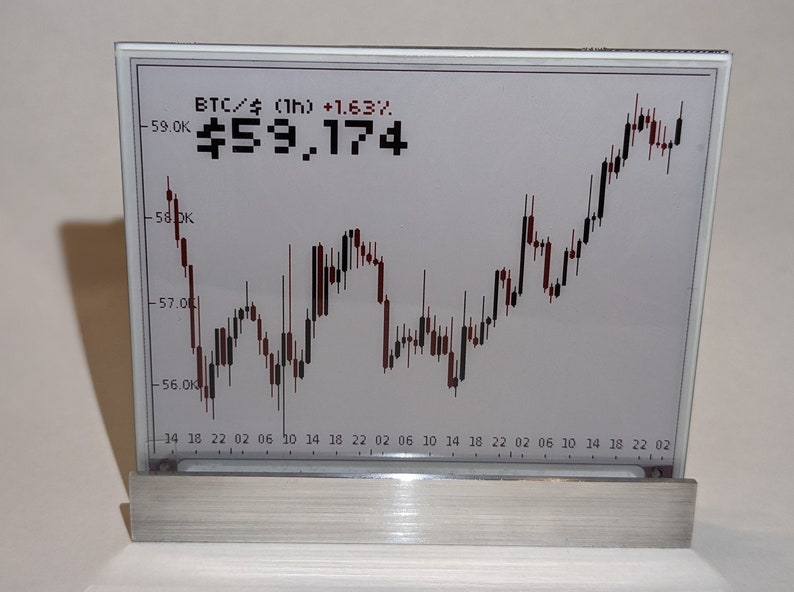
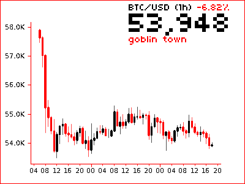
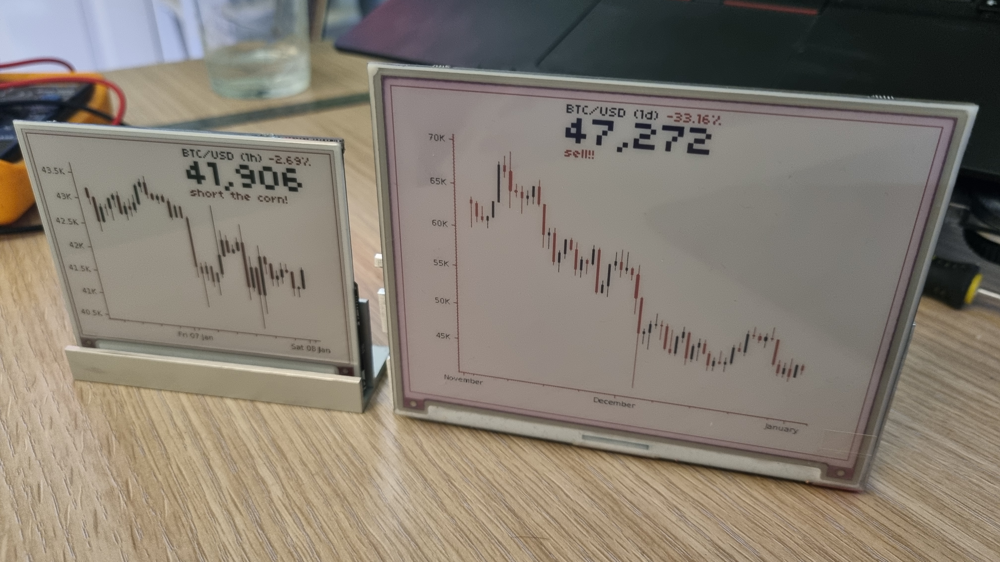

# 🤖 **BitBot**
> A Raspberry Pi powered e-ink crypto price chart  
> [Hardware may be purchased on Etsy here](https://www.etsy.com/uk/listing/989665092)
<div>
    
    
    
    
    
</div>


# ✨ Features
 - 🏦 Capable of charting **any crypto-currency** from **many different exchanges**
 - 🏛️ Supports regular **stock prices**
 - 🖼️ **Picture-frame mode** allows any image to be easily ***uploaded for display.***
 - 🆘 A **friendly intro** sequence will guide you through **setup**
 - 💲 Large **current price** header (avoids chart overlap) 
 - 🎲 randomly selected **time frames**, or configured to **your preference**
 - 💰 Supports **tracking** your current **holdings** 
 - 📈 Shows instrument details (e,g, ```(XBT/USD, +12%)```)
 - 📊 Optional **volume chart** 
 - 💬 Displays ***configurable AI commentry*** depending on **price action**
 - 📡 Warns on **connection errors**
 - ⚙️ **Config webserver** running on port **8080** allows easy configuration
 - ♻️ Display **refreshes after config changes** 
 - 👽 Reddit discussion [here](https://www.reddit.com/r/raspberry_pi/comments/mrne5p/my_eink_cryptowatcher/) and [here](https://old.reddit.com/r/raspberry_pi/comments/s3dnnn/i_made_an_aluminium_stand_for_an_eink_display/)

# 💡 Requested Features
 - 💸 Display **Transaction fees**
 - 📺 Smaller/cheaper display

# 📝 Docs
 - [💻 How To **Install**](docs/app_install.md)  
 - [⚙️ Device **Setup**](docs/device_setup.md)  
 - [🔗 Device **Assembly**](docs/device_assembly.md)  
 - [📒 Dev **Notes**](docs/development.md)   
 - [🐋 **Docker** Setup](docs/docker_installation.md)  
 - [📈 current charting examples](docs/test_results.md)
